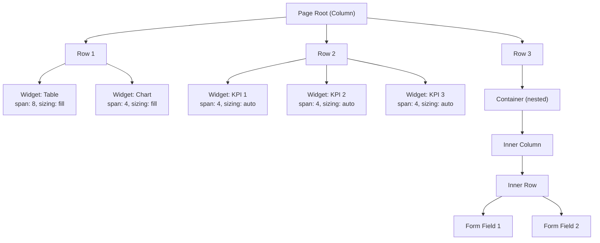

# Retool Hybrid Flow Grid — Layout Revamp Plan

> **Goal**: Replace the current `react-grid-layout` flat grid system with a Retool-style Hybrid Flow Grid that supports nestable containers, auto/fill/fixed sizing, and true responsive flow — while preserving the existing data-binding/runtime layer.

---

## 1. Architecture Overview

### Current System (Problems)

| Component | File | Issue |
|---|---|---|
| `AppPageDropzone` | [appPageDropzone.jsx](file:///d:/PROJECTS/PERSONAL/jet-admin/apps/frontend/src/presentation/components/appPageComponents/appPageDropzone.jsx) | Uses `react-grid-layout` with fixed `rowHeight: 16`, flat widget list, fragile `ResizeObserver` scaling |
| `AppPageViewer` | [appPageViewer.jsx](file:///d:/PROJECTS/PERSONAL/jet-admin/apps/frontend/src/presentation/components/appPageComponents/appPageViewer.jsx) | Same grid, `rowHeight: 32`, mismatched cols `{lg:8, md:6, sm:5, xs:4, xxs:3}` vs dropzone's `{lg:24, md:18, sm:12, xs:8, xxs:4}` |
| `AppPageWidgetSlot` | [appPageWidgetSlot.jsx](file:///d:/PROJECTS/PERSONAL/jet-admin/apps/frontend/src/presentation/components/appPageComponents/appPageWidgetSlot.jsx) | Widget container with manual `useComponentSize` → set fixed `width/height` style. No auto-height. |
| `appPageLayoutUtils` | [appPageLayoutUtils.js](file:///d:/PROJECTS/PERSONAL/jet-admin/apps/frontend/src/presentation/components/appPageComponents/appPageLayoutUtils.js) | `x,y,w,h` per breakpoint per widget. No tree structure. |
| Data Model | `appPageConfig.layouts` | Flat `{ breakpoint: [{ i, x, y, w, h }] }` — no nesting, no sizing modes |

> [!WARNING]
> The current viewer and dropzone use **different column counts** (`8` vs `24`), causing saved layouts to render incorrectly in view mode.

### Target System (Retool Hybrid Flow Grid)



**Core Principles:**
1. **Flow-based** — no `x,y` coordinates. Rows flow top-to-bottom, widgets flow left-to-right within rows.
2. **12-column grid** — widgets specify `span` (1-12) for width, consistent across breakpoints.
3. **Three sizing modes** — `auto` (content-driven height), `fill` (stretch to fill row), `fixed` (explicit px height).
4. **Nestable containers** — containers hold inner column layouts, enabling complex nested structures.
5. **CSS Flexbox + CSS Grid** — rows use `display: grid; grid-template-columns: repeat(12, 1fr)` for column alignment, flex for vertical stacking.

---

## 2. Data Model — Schema Migration

### Old Schema (`layoutVersion: undefined | 1`)
```json
{
  "widgets": ["widget_42_1716000", "widget_87_1716001"],
  "layouts": {
    "lg": [
      { "i": "widget_42_1716000", "x": 0, "y": 0, "w": 12, "h": 8 },
      { "i": "widget_87_1716001", "x": 12, "y": 0, "w": 12, "h": 8 }
    ],
    "md": [...], "sm": [...], "xs": [...], "xxs": [...]
  },
  "dataSources": [...],
  "variables": [...]
}
```

### New Schema (`layoutVersion: 2`)
```json
{
  "layoutVersion": 2,
  "widgets": ["widget_42", "widget_87"],
  "layout": {
    "id": "root",
    "type": "column",
    "children": [
      {
        "id": "row_1",
        "type": "row",
        "children": [
          {
            "id": "slot_1",
            "type": "widget",
            "widgetKey": "widget_42",
            "span": 8,
            "sizing": "fill",
            "minHeight": null,
            "maxHeight": null
          },
          {
            "id": "slot_2",
            "type": "widget",
            "widgetKey": "widget_87",
            "span": 4,
            "sizing": "fill"
          }
        ]
      },
      {
        "id": "row_2",
        "type": "row",
        "children": [
          {
            "id": "container_1",
            "type": "container",
            "span": 12,
            "sizing": "auto",
            "children": {
              "id": "container_1_col",
              "type": "column",
              "children": []
            }
          }
        ]
      }
    ]
  },
  "dataSources": [...],
  "variables": [...]
}
```

### Layout Node Type Definitions

| Node Type | Purpose | Properties | Children |
|---|---|---|---|
| `column` | Vertical stack (root or inner) | `id` | `row[]`, `widget[]`, `container[]` |
| `row` | Horizontal strip | `id`, `gap?` | `widget[]`, `container[]` |
| `widget` | Leaf node for a widget | `id`, `widgetKey`, `span` (1-12), `sizing`, `minHeight?`, `maxHeight?`, `fixedHeight?` | — |
| `container` | Nestable group | `id`, `span` (1-12), `sizing`, `style?` | `column` (inner) |
| `stack` | Flexbox container | `id`, `direction` (h/v), `span`, `sizing`, `wrap?`, `gap?`, `align?` | `widget[]`, `container[]` |

### Sizing Modes

| Mode | Behavior | CSS |
|---|---|---|
| `auto` | Height determined by content | `height: auto` |
| `fill` | Stretch to fill tallest sibling in row | `flex: 1` (within row) |
| `fixed` | Explicit pixel height | `height: {fixedHeight}px` |

---

## 3. Implementation Phases

### Phase 1: Layout Engine Core (No UI Changes Yet)

**New files to create:**

| File | Purpose |
|---|---|
| `appPageComponents/layout/layoutTypes.js` | TypeScript-like JSDoc typedefs for layout node types |
| `appPageComponents/layout/layoutEngine.js` | Core tree manipulation functions (add/remove/move/resize nodes) |
| `appPageComponents/layout/layoutMigration.js` | v1→v2 migration function |
| `appPageComponents/layout/layoutDefaults.js` | Default layout templates, sizing presets |

---

### Phase 2: Layout Renderer (View Mode)

**New files:**

| File | Purpose |
|---|---|
| `layout/LayoutRenderer.jsx` | Recursive renderer — reads layout tree and renders CSS Grid/Flex |
| `layout/LayoutRow.jsx` | Single row — `display: grid; grid-template-columns: repeat(12, 1fr)` |
| `layout/LayoutWidgetSlot.jsx` | Updated widget slot — respects `sizing` mode |
| `layout/LayoutContainer.jsx` | Container node — renders inner `LayoutRenderer` |
| `layout/LayoutStack.jsx` | Stack node — flex container with direction toggle |
| `layout/layout.css` | All layout CSS classes |

---

### Phase 3: Layout Editor (Drag & Drop)

**New files:**

| File | Purpose |
|---|---|
| `layout/LayoutEditorCanvas.jsx` | Replaces `AppPageDropzone`. Renders editable layout tree with drop zones. |
| `layout/LayoutDragHandle.jsx` | Drag handle for reordering widgets within/between rows |
| `layout/LayoutDropIndicator.jsx` | Visual drop target indicators (blue lines, insertion points) |
| `layout/LayoutResizeHandle.jsx` | Column span resize handle (drag to change span) |
| `layout/LayoutNodeToolbar.jsx` | Floating toolbar per node (sizing mode, span, delete, wrap in container) |
| `layout/useLayoutDnd.js` | DnD hook using `react-dnd` — handles drop logic, auto-row creation |
| `layout/useLayoutEditor.js` | Top-level hook — connects layout engine to formik state |

---

### Phase 4: Widget Slot Upgrade

**Changes to `AppPageWidgetSlot`:**
- Remove `useComponentSize` hook — no longer need to manually measure
- Remove fixed `width`/`height` style — CSS handles sizing via grid/flex
- Add `sizing` prop — drives `auto`/`fill`/`fixed` CSS class
- Widget content renders inside a `min-height: 0; flex: 1` container (prevents overflow)

---

### Phase 5: Integration & Migration

**Files to modify:**

| File | Changes |
|---|---|
| `appPageViewer.jsx` | Replace `ResponsiveReactGridLayout` with `<LayoutRenderer layout={pageConfig.layout} />`. Add migration check. |
| `appPageDropzone.jsx` | Replace with `<LayoutEditorCanvas />` |
| `appPageUpdationForm.jsx` | Update props — pass `layout` instead of `layouts`. Use `useLayoutEditor`. |
| `appPageAdditionForm.jsx` | Same as above. Default to empty v2 layout. |
| `appPageLayoutUtils.js` | Deprecate. Replace with `layoutEngine.js`. Keep for migration. |

---

## 4. File Change Summary

### New Files (12)

```
appPageComponents/layout/
├── layoutTypes.js          # Type definitions
├── layoutEngine.js         # Tree manipulation (pure functions)
├── layoutMigration.js      # v1 → v2 migration
├── layoutDefaults.js       # Default templates
├── layout.css              # All layout CSS
├── LayoutRenderer.jsx      # Recursive view renderer
├── LayoutRow.jsx           # Grid row component
├── LayoutWidgetSlot.jsx    # Updated widget slot wrapper
├── LayoutContainer.jsx     # Nestable container
├── LayoutStack.jsx         # Flex stack component
├── LayoutEditorCanvas.jsx  # Editor-mode canvas (replaces Dropzone)
├── LayoutNodeToolbar.jsx   # Per-node editing toolbar
├── LayoutDropIndicator.jsx # DnD drop target visuals
├── LayoutResizeHandle.jsx  # Span resize handle
├── useLayoutDnd.js         # DnD hook
└── useLayoutEditor.js      # Editor state hook
```

### Modified Files (6)

| File | Scope |
|---|---|
| `appPageViewer.jsx` | Major rewrite — swap grid for LayoutRenderer |
| `appPageDropzone.jsx` | Deprecate → thin wrapper around LayoutEditorCanvas |
| `appPageUpdationForm.jsx` | Update layout prop plumbing |
| `appPageAdditionForm.jsx` | Update layout prop plumbing |
| `appPageWidgetSlot.jsx` | Remove useComponentSize, add sizing props |
| `appPageLayoutUtils.js` | Deprecate most functions, keep for migration |
