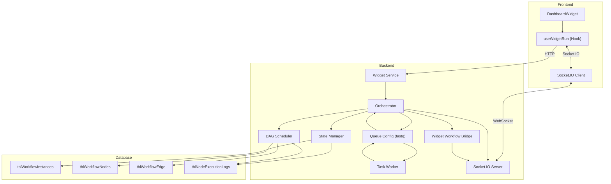
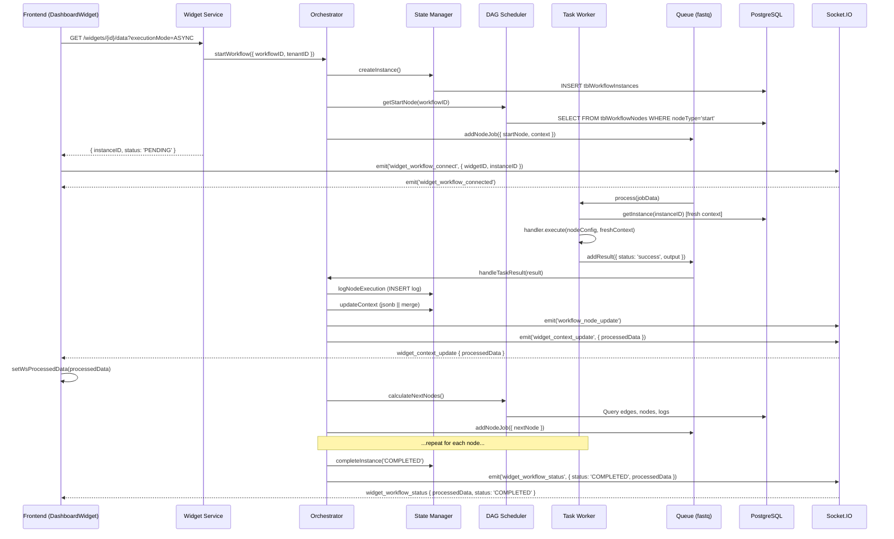
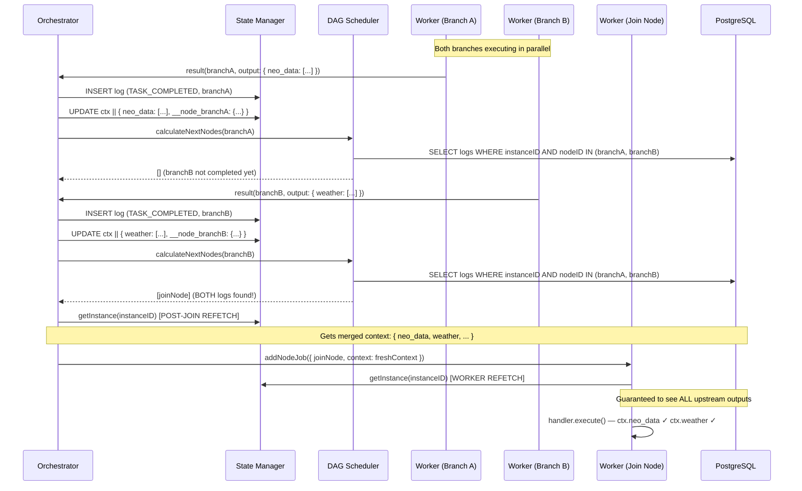

# Workflow Engine — Complete Implementation Guide

## Table of Contents
1. [Architecture Overview](#1-architecture-overview)
2. [Component Deep Dive](#2-component-deep-dive)
3. [Complete Data Flow](#3-complete-data-flow)
4. [Join/Barrier Pattern](#4-joinbarrier-pattern)
5. [Concurrency & Race Condition Analysis](#5-concurrency--race-condition-analysis)
6. [Challenges in Earlier Implementation](#6-challenges-in-earlier-implementation)
7. [What We Did to Rectify](#7-what-we-did-to-rectify)
8. [Low Load vs High Load Behavior](#8-low-load-vs-high-load-behavior)
9. [Audit Findings](#9-audit-findings)
10. [Frontend Real-Time Data Delivery](#10-frontend-real-time-data-delivery)

---

## 1. Architecture Overview



### Key Design Principles
| Principle | Implementation |
|-----------|---------------|
| **Atomic State Updates** | PostgreSQL `jsonb \|\| jsonb` operator in `stateManager.updateContext` |
| **Append-Only Audit Trail** | `tblNodeExecutionLogs` — INSERT-only, never updated |
| **In-Process Queuing** | `fastq` with concurrency=10 for both task and results queues |
| **Dual-Layer Data Freshness** | Context refetched in both orchestrator (post-barrier) and worker (pre-execution) |
| **Socket Room Isolation** | Each widget gets its own room (`widget:{widgetID}`), each instance gets a room (`{instanceID}`) |

---

## 2. Component Deep Dive

### 2.1 DAG Scheduler ([dagScheduler.js](file:///d:/PROJECTS/PERSONAL/jet-admin/apps/backend/modules/workflow/orchestrator/dagScheduler.js))

**Purpose**: Graph traversal engine. Given a completed node and its output handle, determines which downstream nodes are eligible to run next.

| Method | Purpose | DB Tables |
|--------|---------|-----------|
| [getStartNode(workflowID)](file:///d:/PROJECTS/PERSONAL/jet-admin/apps/backend/modules/workflow/orchestrator/dagScheduler.js#10-28) | Find the `type='start'` node | `tblWorkflowNodes` |
| [getWorkflowNodes(workflowID)](file:///d:/PROJECTS/PERSONAL/jet-admin/apps/backend/modules/workflow/orchestrator/dagScheduler.js#29-39) | List all nodes | `tblWorkflowNodes` |
| [getWorkflowEdges(workflowID)](file:///d:/PROJECTS/PERSONAL/jet-admin/apps/backend/modules/workflow/orchestrator/dagScheduler.js#40-50) | List all edges | `tblWorkflowEdge` |
| [getIncomingEdges(workflowID, nodeID)](file:///d:/PROJECTS/PERSONAL/jet-admin/apps/backend/modules/workflow/orchestrator/dagScheduler.js#51-65) | All edges INTO a node | `tblWorkflowEdge` |
| [isNodeReadyToExecute(params)](file:///d:/PROJECTS/PERSONAL/jet-admin/apps/backend/modules/workflow/orchestrator/dagScheduler.js#66-129) | Barrier/join check | `tblNodeExecutionLogs` |
| [calculateNextNodes(...)](file:///d:/PROJECTS/PERSONAL/jet-admin/apps/backend/modules/workflow/orchestrator/dagScheduler.js#130-205) | Full next-node resolution with barrier | All above |

#### [calculateNextNodes](file:///d:/PROJECTS/PERSONAL/jet-admin/apps/backend/modules/workflow/orchestrator/dagScheduler.js#130-205) — Step-by-Step

```
1. Query outgoing edges from completedNodeID
2. Filter edges by sourceHandle === outputHandle
3. Collect downstream nodeIDs
4. Fetch candidate node records
5. For EACH candidate:
   a. Get ALL incoming edges to that candidate
   b. Read candidate's joinMode from nodeConfig (default: 'all')
   c. Call isNodeReadyToExecute → query tblNodeExecutionLogs
   d. If ready → include in result array
6. Return ready nodes only
```

#### [isNodeReadyToExecute](file:///d:/PROJECTS/PERSONAL/jet-admin/apps/backend/modules/workflow/orchestrator/dagScheduler.js#66-129) — Barrier Logic

```
Input: incomingEdges[], instanceID, joinMode, isTestRun, contextData

If ≤1 incoming edge → return true (no fan-in, always ready)

If isTestRun:
  Check contextData[`__node_${upstreamNodeID}`] exists
  Apply joinMode logic (all/any)

If real run:
  SELECT nodeID FROM tblNodeExecutionLogs
  WHERE instanceID = ? AND eventType = 'TASK_COMPLETED' AND nodeID IN (upstreamNodeIDs)

  completedSet = Set(results)
  joinMode === 'any' ? some(in set) : every(in set)
```

> [!IMPORTANT]
> **Why logs-based, not context-based?** Execution logs are committed via `INSERT` at line 39 of [orchestrator.js](file:///d:/PROJECTS/PERSONAL/jet-admin/apps/backend/modules/workflow/orchestrator/orchestrator.js) **BEFORE** the context update at line 65. This guarantees that when two parallel branches complete, each branch's `TASK_COMPLETED` log is visible to the other's barrier check even if the `jsonb` merge hasn't committed yet.

---

### 2.2 Orchestrator ([orchestrator.js](file:///d:/PROJECTS/PERSONAL/jet-admin/apps/backend/modules/workflow/orchestrator/orchestrator.js))

**Purpose**: The core Check-Decide-Act cycle. Receives task results from workers, updates state, emits events, and queues the next nodes.

#### [handleTaskResult(result)](file:///d:/PROJECTS/PERSONAL/jet-admin/apps/backend/modules/workflow/orchestrator/orchestrator.js#14-211) — Complete Flow

```
Input: { instanceID, nodeID, nodeType, outputVariable, status, output, nextHandle, queueDelay, error }

Step 1: GET instance from DB (stateManager.getInstance)
Step 2: LOG execution event (INSERT into tblNodeExecutionLogs)      ← COMMITTED FIRST
Step 3: BUILD contextUpdate object:
        - ctx[outputVariable] = output[outputVariable] || output
        - ctx.output = output.workflowOutput  (if terminal)
        - ctx[`__node_${nodeID}`] = { output, status, outputVariable }
Step 4: ATOMIC MERGE into tblWorkflowInstances.contextData          ← jsonb || jsonb
Step 5: EMIT WebSocket events:
        - workflow_node_update → instanceID room (for log/debug)
        - widget_context_update → per-widget rooms (via bridge)
Step 6: CHECK if terminal node (type === 'end')
        - If yes: completeInstance + emit COMPLETED status + return
Step 7: CALCULATE next nodes:
        - Test-run path: use in-memory workflowDefinition
        - Real path: dagScheduler.calculateNextNodes (with barrier)
Step 8: POST-JOIN REFETCH:
        - If nextNodes.length > 0 → stateManager.getInstance(instanceID)
        - Overwrite updatedInstance with freshInstance
Step 9: QUEUE each nextNode via addNodeJob with updatedInstance.contextData
```

#### Critical Ordering Guarantee

```
Line 39:  logNodeExecution (INSERT)     ← Committed to DB first
Line 65:  updateContext (jsonb merge)    ← Atomic merge second
Line 81:  emitContextUpdate (Socket)    ← Notification third
Line 169: getInstance (refetch)         ← Fresh context fourth
Line 182: addNodeJob (queue next)       ← Queue with latest context last
```

This ordering ensures that when a barrier check runs for the other branch, the `TASK_COMPLETED` log is always visible.

---

### 2.3 State Manager ([stateManager.js](file:///d:/PROJECTS/PERSONAL/jet-admin/apps/backend/modules/workflow/orchestrator/stateManager.js))

**Purpose**: All database operations for workflow instances.

#### [updateContext](file:///d:/PROJECTS/PERSONAL/jet-admin/apps/backend/modules/workflow/orchestrator/stateManager.js#46-79) — Atomic JSON Merge

```sql
UPDATE "tblWorkflowInstances"
SET "contextData" = "contextData" || $1::jsonb,
    "updatedAt" = NOW()
WHERE "instanceID" = $2::uuid
RETURNING *
```

| Property | Behavior |
|----------|----------|
| **Atomicity** | Single SQL statement — PostgreSQL guarantees row-level lock during UPDATE |
| **Merge semantics** | `\|\|` operator merges top-level keys; existing keys not in `$1` are preserved |
| **Concurrency** | Two concurrent UPDATEs will serialize at the row lock — no data loss |
| **Return value** | Returns the row state AFTER this specific merge (may not include the other concurrent merge) |

> [!NOTE]
> The `RETURNING *` result only contains **this thread's** merge. A concurrent thread's merge may not be reflected yet. This is why we do a **post-join refetch** in the orchestrator.

#### [logNodeExecution](file:///d:/PROJECTS/PERSONAL/jet-admin/apps/backend/modules/workflow/orchestrator/stateManager.js#104-121) — Append-Only

```javascript
await prisma.tblNodeExecutionLogs.create({
  data: {
    instanceID,
    nodeID: isTest ? null : nodeID,     // FK to tblWorkflowNodes (real runs)
    nodeUUID: isTest ? nodeID : null,    // Plain UUID string (test runs)
    eventType,                           // 'TASK_COMPLETED' | 'TASK_FAILED'
    inputData, outputData, errorMessage,
  },
});
```

| Column | Real Run | Test Run |
|--------|----------|----------|
| `nodeID` | FK to `tblWorkflowNodes.nodeID` | `null` |
| `nodeUUID` | `null` | In-memory UUID string |

> [!WARNING]
> **Test-run barrier fallback**: Since test runs store `nodeUUID` (not `nodeID`), the logs-based barrier query won't find matches. The [isNodeReadyToExecute](file:///d:/PROJECTS/PERSONAL/jet-admin/apps/backend/modules/workflow/orchestrator/dagScheduler.js#66-129) method falls back to `contextData.__node_{id}` checks for test runs. This is intentional and documented in the code.

---

### 2.4 Task Worker ([taskWorker.js](file:///d:/PROJECTS/PERSONAL/jet-admin/apps/backend/modules/workflow/workers/taskWorker.js))

**Purpose**: Executes node handlers (API calls, JS scripts, data queries, delays, etc.) and reports results.

#### Execution Pipeline

```
1. Receive jobData from fastq
2. If NOT test run AND instanceID exists:
   a. Fetch fresh instance from DB (stateManager.getInstance)
   b. Use freshInstance.contextData as currentContext
   c. This is the WORKER-SIDE DATA FRESHNESS layer
3. Get handler for nodeType (getHandler)
4. Execute handler.execute(nodeConfig, currentContext, utilities)
5. On success: addResult({ status: 'success', output, nextHandle })
6. On failure:
   a. If attempts < maxAttempts: re-queue with exponential backoff
   b. Else: addResult({ status: 'error', error })
```

#### Why Worker-Side Refetch?

The orchestrator passes `updatedInstance.contextData` to [addNodeJob](file:///d:/PROJECTS/PERSONAL/jet-admin/apps/backend/config/queue.config.js#102-139). But between the time the job is queued and the time the worker picks it up, another parallel branch may have committed new data. The worker refetch ensures the handler always sees the absolute latest state.

```
Timeline:
  T1: Branch A completes → orchestrator merges A's output → queues join node with ctxA
  T2: Branch B completes → orchestrator merges B's output (but join node already queued with ctxA)
  T3: Worker picks up join node → refetches from DB → gets ctx with BOTH A and B outputs ✓
```

---

### 2.5 Queue Configuration ([queue.config.js](file:///d:/PROJECTS/PERSONAL/jet-admin/apps/backend/config/queue.config.js))

**Purpose**: In-memory job queuing using `fastq` (replaces RabbitMQ for single-process deployments).

| Queue | Concurrency | Purpose |
|-------|-------------|---------|
| `taskQueue` | 10 | Node execution jobs |
| `resultsQueue` | 10 | Result processing (orchestrator) |

#### Concurrency Model

```
fastq concurrency=10 means:
- Up to 10 tasks can execute SIMULTANEOUSLY
- Each task is an async function
- fastq manages the parallelism internally
- No external broker — everything is in-process
```

> [!IMPORTANT]
> With concurrency=10, during a dashboard load that triggers 3 workflows simultaneously, up to 10 node handlers can be executing in parallel. This is what makes the race conditions possible and why atomic operations are critical.

#### Delay Support

```javascript
if (options.delay > 0) {
  setTimeout(() => taskQueue.push(message), options.delay);
}
```

Used for: delay nodes, retry backoff (`2^attempts * 1000ms`).

---

### 2.6 Widget Workflow Bridge ([widgetWorkflowBridge.js](file:///d:/PROJECTS/PERSONAL/jet-admin/apps/backend/modules/widget/widgetWorkflowBridge.js))

**Purpose**: Manages the link between widgets and workflow instances. Processes raw context into widget-specific data and pushes it to the frontend via Socket.IO.

#### In-Memory State

```javascript
const widgetConnections = new Map();   // widgetID → { instanceID, socketId, widgetConfig, ... }
const instanceWidgets = new Map();     // instanceID → Set<widgetID>
```

#### Data Processing Pipeline

```
1. Orchestrator calls emitContextUpdate(instanceID, { contextSnapshot })
2. Bridge looks up all widgets subscribed to this instanceID
3. For EACH widget:
   a. Get widget's stored config (widgetType, widgetConfig, workflowConfig)
   b. resolveTemplate(widgetConfig, { ctx: contextSnapshot })
      → Deep-resolves all {{ctx.variableName}} expressions
   c. processWorkflowDataForWidget({ widgetType, widgetConfig: resolved })
      → Delegates to VegaWidgetBuilder or TableWidgetBuilder
   d. Emit processed data to widget's Socket.IO room
```

#### Widget Builders (Pure Functions)

| Builder | Input | Output |
|---------|-------|--------|
| [VegaWidgetBuilder](file:///d:/PROJECTS/PERSONAL/jet-admin/packages/widgets-logic/src/vega/builder.js#10-40) | `widgetConfig.vegaSpec` with resolved `data.values` | Complete Vega-Lite spec with `$schema`, `autosize` defaults |
| [TableWidgetBuilder](file:///d:/PROJECTS/PERSONAL/jet-admin/packages/widgets-logic/src/table/builder.js#11-47) | `widgetConfig.dataArrayTemplate` (resolved array) | `{ data, columns, pagination }` |

Both builders are **stateless** — they create new objects every time. No mutation, no shared state.

---

### 2.7 Frontend: useWidgetRun ([useWidgetRun.jsx](file:///d:/PROJECTS/PERSONAL/jet-admin/apps/frontend/src/presentation/components/widgetComponents/useWidgetRun.jsx))

**Purpose**: React hook that manages the widget's entire lifecycle: HTTP execution, Socket.IO real-time updates, and data resolution.

#### Socket Event Listeners

| Event | Filter | Purpose |
|-------|--------|---------|
| `widget_workflow_connected` | `data.widgetID === targetWidgetID` | Connection confirmed |
| `widget_context_update` | `data.widgetID === targetWidgetID` | Per-node data update (processedData) |
| `widget_workflow_status` | `data.widgetID === targetWidgetID` | Workflow completion (final processedData) |
| `widget_workflow_error` | `data.widgetID === targetWidgetID` | Error handling |
| `workflow_node_update` | `nodeData.instanceID === instanceID` | Per-node log (debug) |
| `workflow_status_update` | `statusData.instanceID === instanceID` | Global workflow status |

#### Data Priority Resolution

```javascript
const finalData = useMemo(() => {
  // Priority: Live Socket Data > Local Sync Data > Initial/Fetched Data
  if (wsProcessedData) return { ...localData, workflowInstances: { data: wsProcessedData } };
  return localData || widgetFetchedData;
}, [wsProcessedData, localData, widgetFetchedData, workflowStatus]);
```

---

## 3. Complete Data Flow

### 3.1 Single Widget Execution (Happy Path)



### 3.2 Parallel Fan-In (Join Pattern)



---

## 4. Join/Barrier Pattern

### 4.1 Configuration

Each workflow node has an optional `joinMode` in its `nodeConfig`:

```json
{
  "nodeConfig": {
    "joinMode": "all",      // "all" (default) | "any"
    "outputVariable": "result",
    ...other config...
  }
}
```

Configured via the **Advanced Settings** collapsible panel in the [WorkflowNodeConfigPanel](file:///d:/PROJECTS/PERSONAL/jet-admin/apps/frontend/src/presentation/components/workflowComponents/workflowNodeConfigPanel.jsx).

### 4.2 Join Modes

| Mode | Behavior | Use Case |
|------|----------|----------|
| `all` (default) | Waits for **every** upstream parent to complete | Data aggregation (merge results from parallel API calls) |
| `any` | Fires when the **first** upstream parent completes | Fastest-response pattern (use whichever data source responds first) |

### 4.3 Barrier Check Location

The barrier is checked in `dagScheduler.calculateNextNodes()`. This means:
- The check happens **inside the orchestrator's result-handling loop**
- It runs **after** the current node's log has been committed
- It queries **committed logs**, not in-flight state

---

## 5. Concurrency & Race Condition Analysis

### 5.1 Race Condition Vectors (All Resolved)

#### Vector 1: Context Overwrite (Read-Modify-Write)

```
OLD IMPLEMENTATION:
  Thread A: READ context → context = { input: {} }
  Thread B: READ context → context = { input: {} }
  Thread A: WRITE { input: {}, neo_data: [...] }
  Thread B: WRITE { input: {}, weather: [...] }  ← OVERWRITES neo_data!

NEW IMPLEMENTATION:
  Thread A: UPDATE ctx = ctx || { neo_data: [...] }   ← Row-level lock held
  Thread B: UPDATE ctx = ctx || { weather: [...] }    ← Waits for A's lock, then merges
  Final: { input: {}, neo_data: [...], weather: [...] } ✓
```

#### Vector 2: Barrier Check Timing

```
OLD IMPLEMENTATION (context-based barrier):
  Thread A: UPDATE ctx with __node_branchA
  Thread B: UPDATE ctx with __node_branchB
  Thread A: Check ctx for __node_branchB → NOT FOUND (B's UPDATE hasn't committed!)
  Thread B: Check ctx for __node_branchA → NOT FOUND (A's UPDATE is committed but B doesn't see it in RETURNING)
  Result: DEADLOCK — join node never fires

NEW IMPLEMENTATION (logs-based barrier):
  Thread A: INSERT log (branchA, TASK_COMPLETED) ← Committed immediately
  Thread B: INSERT log (branchB, TASK_COMPLETED) ← Committed immediately
  Thread A: SELECT logs WHERE TASK_COMPLETED AND nodeID IN (A,B) → finds A only → NOT READY
  Thread B: SELECT logs WHERE TASK_COMPLETED AND nodeID IN (A,B) → finds A AND B → READY ✓
```

#### Vector 3: Stale Context in Queued Job

```
OLD IMPLEMENTATION:
  Orchestrator queues join node with ctx from its own RETURNING result
  That ctx may not include the OTHER branch's merge yet
  Join node executes with partial data → undefined errors

NEW IMPLEMENTATION (Dual-Layer Refetch):
  Layer 1 (Orchestrator): After barrier passes, getInstance(instanceID) → fresh from DB
  Layer 2 (Worker): Before execution, getInstance(instanceID) → absolute latest from DB
  Both layers ensure the join node always has complete data
```

#### Vector 4: Frontend Socket Cross-Talk

```
OLD IMPLEMENTATION:
  Widget A and Widget B share the same Socket.IO connection
  When Widget A's workflow completes → emits workflow_status_update
  Widget B's handleWorkflowStatus receives it → sets status = 'COMPLETED'
  Widget B disconnects from socket → stops receiving its own real updates!

NEW IMPLEMENTATION:
  handleWorkflowStatus: if (statusData.instanceID !== instanceID) return;
  handleNodeUpdate: if (nodeData.instanceID !== instanceID) return;
  Each widget only processes events for its own workflow instance
```

### 5.2 Remaining Concurrency Properties

| Property | Status | Details |
|----------|--------|---------|
| Context merge atomicity | ✅ Safe | Row-level lock via PostgreSQL UPDATE |
| Barrier check accuracy | ✅ Safe | Logs-based (INSERT before merge) |
| Join node data completeness | ✅ Safe | Dual-layer refetch |
| Socket event isolation | ✅ Safe | `widgetID` + `instanceID` filtering |
| Widget bridge thread safety | ✅ Safe | Node.js single-threaded; Map operations are synchronous |
| Queue overflow | ⚠️ Monitor | fastq has no max-size limit; under extreme load, memory could grow |
| DB connection pool exhaustion | ⚠️ Monitor | Each worker refetch adds 1 query; with concurrency=10, up to 10 extra queries |

---

## 6. Challenges in Earlier Implementation

### 6.1 Challenge: Non-Atomic Context Updates

**Root Cause**: The original [updateContext](file:///d:/PROJECTS/PERSONAL/jet-admin/apps/backend/modules/workflow/orchestrator/stateManager.js#46-79) used Prisma's standard [update()](file:///d:/PROJECTS/PERSONAL/jet-admin/apps/backend/modules/workflow/orchestrator/stateManager.js#46-79):
```javascript
// OLD — Read-Modify-Write pattern
const instance = await prisma.tblWorkflowInstances.findUnique({ where: { instanceID } });
const merged = { ...instance.contextData, ...contextUpdate };
await prisma.tblWorkflowInstances.update({
  where: { instanceID },
  data: { contextData: merged }
});
```

**Impact**: When two branches of a parallel workflow completed within milliseconds, the second [update()](file:///d:/PROJECTS/PERSONAL/jet-admin/apps/backend/modules/workflow/orchestrator/stateManager.js#46-79) would overwrite the first's changes. This caused data loss — one branch's output would disappear from the context.

### 6.2 Challenge: Premature Join Execution

**Root Cause**: No barrier/join logic existed. Every downstream node was queued immediately when its parent completed.

**Impact**: In a workflow like `Start → [BranchA, BranchB] → JoinNode`, the join node would fire twice (once per parent) and execute with incomplete data. The second execution would overwrite the first's results.

### 6.3 Challenge: False Barrier Deadlocks

**Root Cause**: The first barrier implementation used `contextData.__node_{id}` keys to check if upstream parents had completed. But due to the `RETURNING` clause behavior, the `contextData` returned by one thread's `UPDATE` didn't include the other thread's concurrent merge.

**Impact**: Both branches would check the context, neither would see the other's `__node_` key, and the join node would never fire — causing the workflow to hang permanently.

### 6.4 Challenge: Stale Context in Job Payload

**Root Cause**: The orchestrator passed `updatedInstance.contextData` (from its own `RETURNING` result) to [addNodeJob](file:///d:/PROJECTS/PERSONAL/jet-admin/apps/backend/config/queue.config.js#102-139). This context might not include the other branch's data.

**Impact**: Even after the barrier was fixed, the join node would execute with partial context — leading to `Cannot read properties of undefined` errors when trying to access the missing branch's output variable.

### 6.5 Challenge: Frontend Socket Cross-Talk

**Root Cause**: On a dashboard with multiple widgets, all widgets share one Socket.IO connection. Global events like `workflow_status_update` and `workflow_node_update` were processed by every widget without filtering by `instanceID`.

**Impact**: When a faster workflow completed, its `COMPLETED` status would cause slower widgets to prematurely disconnect their real-time data streams, showing empty/error states even though their data was still being computed.

### 6.6 Challenge: [const](file:///d:/PROJECTS/PERSONAL/jet-admin/apps/frontend/src/data/models/workflowNode.js#8-33) vs [let](file:///d:/PROJECTS/PERSONAL/jet-admin/apps/frontend/src/presentation/components/workflowComponents/workflowNodeConfigPanel.jsx#22-27) Crash

**Root Cause**: `updatedInstance` was declared as [const](file:///d:/PROJECTS/PERSONAL/jet-admin/apps/frontend/src/data/models/workflowNode.js#8-33) but the post-join refetch needed to reassign it.

**Impact**: `Assignment to constant variable` error caused every workflow execution to fail immediately.

---

## 7. What We Did to Rectify

### Summary Matrix

| Challenge | Fix | File | Lines |
|-----------|-----|------|-------|
| Non-atomic merge | `jsonb \|\| jsonb` via `$queryRawUnsafe` | [stateManager.js](file:///d:/PROJECTS/PERSONAL/jet-admin/apps/backend/modules/workflow/orchestrator/stateManager.js) | 55-78 |
| No barrier logic | [getIncomingEdges](file:///d:/PROJECTS/PERSONAL/jet-admin/apps/backend/modules/workflow/orchestrator/dagScheduler.js#51-65) + [isNodeReadyToExecute](file:///d:/PROJECTS/PERSONAL/jet-admin/apps/backend/modules/workflow/orchestrator/dagScheduler.js#66-129) + [calculateNextNodes](file:///d:/PROJECTS/PERSONAL/jet-admin/apps/backend/modules/workflow/orchestrator/dagScheduler.js#130-205) filtering | [dagScheduler.js](file:///d:/PROJECTS/PERSONAL/jet-admin/apps/backend/modules/workflow/orchestrator/dagScheduler.js) | 57-203 |
| False deadlocks | Switch from `contextData` keys to `tblNodeExecutionLogs` queries | [dagScheduler.js](file:///d:/PROJECTS/PERSONAL/jet-admin/apps/backend/modules/workflow/orchestrator/dagScheduler.js) | 100-127 |
| Stale context (orchestrator) | Post-join [getInstance](file:///d:/PROJECTS/PERSONAL/jet-admin/apps/backend/modules/workflow/orchestrator/stateManager.js#35-45) refetch | [orchestrator.js](file:///d:/PROJECTS/PERSONAL/jet-admin/apps/backend/modules/workflow/orchestrator/orchestrator.js) | 164-177 |
| Stale context (worker) | Pre-execution [getInstance](file:///d:/PROJECTS/PERSONAL/jet-admin/apps/backend/modules/workflow/orchestrator/stateManager.js#35-45) refetch | [taskWorker.js](file:///d:/PROJECTS/PERSONAL/jet-admin/apps/backend/modules/workflow/workers/taskWorker.js) | 30-40 |
| Socket cross-talk | `instanceID` filtering on global events | [useWidgetRun.jsx](file:///d:/PROJECTS/PERSONAL/jet-admin/apps/frontend/src/presentation/components/widgetComponents/useWidgetRun.jsx) | 218, 242 |
| [const](file:///d:/PROJECTS/PERSONAL/jet-admin/apps/frontend/src/data/models/workflowNode.js#8-33) crash | Changed to [let](file:///d:/PROJECTS/PERSONAL/jet-admin/apps/frontend/src/presentation/components/workflowComponents/workflowNodeConfigPanel.jsx#22-27) | [orchestrator.js](file:///d:/PROJECTS/PERSONAL/jet-admin/apps/backend/modules/workflow/orchestrator/orchestrator.js) | 65 |
| Configurable join mode | Advanced Settings UI + `joinMode` in `nodeConfig` | [workflowNodeConfigPanel.jsx](file:///d:/PROJECTS/PERSONAL/jet-admin/apps/frontend/src/presentation/components/workflowComponents/workflowNodeConfigPanel.jsx) | 65-92 |

---

## 8. Low Load vs High Load Behavior

### 8.1 Low Load (1-2 widgets, sequential workflows)

| Aspect | Old Implementation | New Implementation |
|--------|-------------------|-------------------|
| **Correctness** | ✅ Works (no concurrency) | ✅ Works |
| **Performance** | Faster (no extra DB queries) | +1 DB query per node (worker refetch) |
| **Latency per node** | ~1 DB write | ~1 DB write + 1 DB read |
| **Context accuracy** | Correct (no parallel writes) | Correct |
| **Join behavior** | N/A (no barrier check) | Barrier check runs but passes immediately |
| **Overall overhead** | None | Minimal (~5-15ms extra per node) |

### 8.2 High Load (Dashboard with 3+ widgets, parallel workflows)

| Aspect | Old Implementation | New Implementation |
|--------|-------------------|-------------------|
| **Context integrity** | ❌ Data loss (overwrites) | ✅ Atomic merges |
| **Join reliability** | ❌ Deadlocks or premature firing | ✅ Logs-based barrier |
| **Data completeness** | ❌ Stale/partial context | ✅ Dual-layer refetch |
| **Socket isolation** | ❌ Cross-talk between widgets | ✅ `instanceID` + `widgetID` filtering |
| **DB query count** | N nodes × 1 write | N nodes × (1 write + 1-2 reads) |
| **Connection pool usage** | Low | Higher (monitor for pool exhaustion) |
| **Memory usage** | Same | Same (no new in-memory structures) |

### 8.3 Scalability Considerations

```
Current architecture: Single-process, in-memory queues (fastq)

Bottleneck thresholds:
┌─────────────────────────┬──────────────┬─────────────────────┐
│ Metric                  │ Safe Range   │ Action if Exceeded  │
├─────────────────────────┼──────────────┼─────────────────────┤
│ Concurrent workflows    │ ≤50          │ Add queue backpressure│
│ DB connection pool      │ ≤20 active   │ Increase pool size  │
│ fastq concurrency       │ 10 (current) │ Tune based on CPU   │
│ Widget WebSocket rooms  │ ≤200         │ Move to Redis adapter│
│ Context JSON size       │ ≤10MB        │ Externalize large data│
└─────────────────────────┴──────────────┴─────────────────────┘
```

### 8.4 Performance Cost of Safety Measures

| Safety Layer | Extra DB Queries | Latency Impact | When Needed |
|--------------|-----------------|----------------|-------------|
| Atomic merge (`jsonb \|\|`) | 0 (replaces old write) | ~0ms | Always |
| Logs-based barrier | 1 SELECT per candidate node | ~5ms per check | Only at join points |
| Orchestrator refetch | 1 SELECT per join pass | ~5ms | Only when barrier passes |
| Worker refetch | 1 SELECT per node execution | ~5ms | Every real-run node |
| **Total worst-case per node** | **+3 queries** | **~15ms** | — |

---

## 9. Audit Findings

### 9.1 Correctness Audit

| Component | Status | Notes |
|-----------|--------|-------|
| [dagScheduler.js](file:///d:/PROJECTS/PERSONAL/jet-admin/apps/backend/modules/workflow/orchestrator/dagScheduler.js) | ✅ Correct | Barrier logic sound; logs-based check is race-free |
| [orchestrator.js](file:///d:/PROJECTS/PERSONAL/jet-admin/apps/backend/modules/workflow/orchestrator/orchestrator.js) | ✅ Correct | Ordering (log → merge → refetch → queue) is correct |
| [stateManager.js](file:///d:/PROJECTS/PERSONAL/jet-admin/apps/backend/modules/workflow/orchestrator/stateManager.js) | ✅ Correct | Atomic merge; `RETURNING *` parsed correctly |
| [taskWorker.js](file:///d:/PROJECTS/PERSONAL/jet-admin/apps/backend/modules/workflow/workers/taskWorker.js) | ✅ Correct | Lazy `require` for stateManager avoids circular deps |
| [queue.config.js](file:///d:/PROJECTS/PERSONAL/jet-admin/apps/backend/config/queue.config.js) | ✅ Correct | Concurrency=10 handles parallelism properly |
| [widgetWorkflowBridge.js](file:///d:/PROJECTS/PERSONAL/jet-admin/apps/backend/modules/widget/widgetWorkflowBridge.js) | ✅ Correct | Pure processing pipeline; no shared mutable state |
| [useWidgetRun.jsx](file:///d:/PROJECTS/PERSONAL/jet-admin/apps/frontend/src/presentation/components/widgetComponents/useWidgetRun.jsx) | ✅ Correct | `instanceID` + `widgetID` filtering on all events |
| [workflowNodeConfigPanel.jsx](file:///d:/PROJECTS/PERSONAL/jet-admin/apps/frontend/src/presentation/components/workflowComponents/workflowNodeConfigPanel.jsx) | ✅ Correct | `joinMode` flows through `node.data` → `nodeConfig` |

### 9.2 Race Condition Audit

| Scenario | Pre-Fix | Post-Fix |
|----------|---------|----------|
| Two branches write context simultaneously | ❌ Data lost | ✅ Atomic merge |
| Barrier check during concurrent completion | ❌ Deadlock | ✅ Logs-based |
| Join node queued with partial context | ❌ Stale data | ✅ Dual refetch |
| Multiple widgets on same dashboard | ❌ Cross-talk | ✅ Event filtering |
| Worker retry after failure | ⚠️ Stale context on retry | ✅ Pre-execution refetch |

### 9.3 Data Validation Audit

| Data Point | Validated? | Details |
|------------|-----------|---------|
| `instanceID` existence | ✅ | Checked at [handleTaskResult](file:///d:/PROJECTS/PERSONAL/jet-admin/apps/backend/modules/workflow/orchestrator/orchestrator.js#14-211) line 29 |
| Node handler existence | ✅ | `getHandler` throws if unknown nodeType |
| Context JSON parse | ✅ | `stateManager.updateContext` parses if string |
| `outputVariable` presence | ✅ | Guarded by `if (outputVariable && output)` |
| `joinMode` value | ⚠️ Implicit | Defaults to `'all'`; no validation on `'any'`/`'all'` — invalid values would default to `'all'` behavior since `every()` would simply check all |
| `workflowID` existence | ✅ | [getStartNode](file:///d:/PROJECTS/PERSONAL/jet-admin/apps/backend/modules/workflow/orchestrator/dagScheduler.js#10-28) throws if no start node found |
| Widget config structure | ✅ | [processContextForWidget](file:///d:/PROJECTS/PERSONAL/jet-admin/apps/backend/modules/widget/widgetWorkflowBridge.js#161-212) returns `null` if no widgetConfig |

### 9.4 Performance Audit

| Concern | Status | Details |
|---------|--------|---------|
| Extra DB reads per node | ⚠️ Acceptable | +1-3 queries per node (~15ms); negligible vs API call latency |
| [getIncomingEdges](file:///d:/PROJECTS/PERSONAL/jet-admin/apps/backend/modules/workflow/orchestrator/dagScheduler.js#51-65) N+1 | ⚠️ Minor | Called once per candidate downstream node; could batch but low priority |
| Widget bridge iteration | ✅ Fine | Iterates widgetConnections Map synchronously; <100 entries typical |
| Prisma connection pool | ⚠️ Monitor | Default pool=5; may need increase for high concurrency |

---

## 10. Frontend Real-Time Data Delivery

### 10.1 Widget Lifecycle

```
1. DashboardWidget mounts
2. useQuery fetches widget config (tblWidgets)
3. useQuery fetches widget data (triggers workflow via widget.service.js)
4. useWidgetRun hydrates instanceID from response
5. Socket.IO connects: emit('widget_workflow_connect', { widgetID, instanceID, widgetConfig })
6. Backend: widgetWorkflowBridge.registerWidget() → joins widget:{widgetID} room
7. As each node completes:
   a. Orchestrator calls emitContextUpdate → bridge processes → emits to widget room
   b. Frontend receives widget_context_update → updates wsProcessedData
   c. Component re-renders with new data
8. On workflow completion:
   a. emitWorkflowStatus → bridge processes → emits to widget room
   b. Frontend receives widget_workflow_status → marks COMPLETED
   c. Socket cleanup runs
```

### 10.2 Template Resolution Flow

```
widgetConfig (from DB):
{
  "vegaSpec": {
    "data": { "values": "{{ctx.neo_data}}" },
    "mark": { "type": "point" },
    "encoding": { ... }
  }
}

After resolveTemplate(widgetConfig, { ctx: contextSnapshot }):
{
  "vegaSpec": {
    "data": { "values": [{ "name": "Asteroid1", ... }, ...] },  ← Array injected
    "mark": { "type": "point" },
    "encoding": { ... }
  }
}

After VegaWidgetBuilder.buildRender():
{
  "$schema": "https://vega.github.io/schema/vega-lite/v5.json",
  "width": "container",
  "height": "container",
  "autosize": { "type": "fit", "contains": "padding" },
  "data": { "values": [...] },
  "mark": { "type": "point" },
  "encoding": { ... }
}
```

This final spec is sent via Socket.IO and rendered by `vega-embed` on the frontend.
